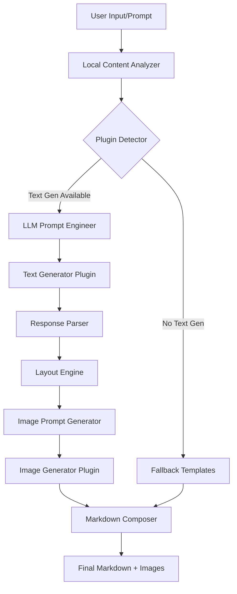

# Architektura techniczna - Smart Slides for Obsidian

## Przepływ danych



## Komponenty główne

### 1. Intelligence Engine

Odpowiedzialny za całą logikę decyzyjną:

```typescript
class IntelligenceEngine {
    private analyzer: ContentAnalyzer;
    private layoutEngine: LayoutEngine;
    private styleDecider: StyleDecider;
    
    async processPrompt(prompt: string): Promise<PresentationContext> {
        // 1. Analiza lokalna
        const context = await this.analyzer.analyze(prompt);
        
        // 2. Decyzje stylowe
        const style = this.styleDecider.decide(context);
        
        // 3. Plan layoutów
        const layoutPlan = this.layoutEngine.plan(context);
        
        return { context, style, layoutPlan };
    }
}
```

### 2. Content Analyzer

Lokalna analiza semantyczna promptu:

```typescript
class ContentAnalyzer {
    analyze(prompt: string): AnalysisResult {
        return {
            audience: this.detectAudience(prompt),
            formality: this.calculateFormality(prompt),
            domain: this.detectDomain(prompt),
            purpose: this.detectPurpose(prompt),
            keywords: this.extractKeywords(prompt),
            expectedSlides: this.estimateSlideCount(prompt)
        };
    }
    
    private detectAudience(prompt: string): Audience {
        const patterns = {
            students: /student|uczni|edukac|lekcj|wykład/i,
            executives: /zarząd|dyrekc|CEO|management|kadra/i,
            technical: /developer|programist|kod|technical/i,
            investors: /inwestor|pitch|VC|startup/i,
            general: /.*/
        };
        
        for (const [audience, pattern] of Object.entries(patterns)) {
            if (pattern.test(prompt)) {
                return audience as Audience;
            }
        }
        return 'general';
    }
}
```

### 3. Layout Engine

Inteligentny dobór layoutów:

```typescript
class LayoutEngine {
    private rules: LayoutRule[] = [
        {
            condition: (content) => this.isComparison(content),
            layout: 'split',
            params: { even: true, gap: '3' }
        },
        {
            condition: (content) => this.isTimeline(content),
            layout: 'grid',
            params: { 
                animate: 'fadeIn',
                frag: 'auto'
            }
        },
        {
            condition: (content) => this.isDataHeavy(content),
            layout: 'grid',
            params: {
                drag: '70 60',
                drop: 'center',
                bg: 'white'
            }
        }
    ];
    
    selectLayout(content: SlideContent): LayoutDecision {
        for (const rule of this.rules) {
            if (rule.condition(content)) {
                return {
                    type: rule.layout,
                    params: rule.params,
                    reasoning: rule.reasoning
                };
            }
        }
        return this.defaultLayout();
    }
}
```

### 4. Plugin Adapters

Uniwersalne adaptery dla różnych pluginów:

```typescript
abstract class BaseAdapter {
    protected plugin: any;
    protected available: boolean;
    
    constructor(app: App, pluginId: string) {
        this.plugin = app.plugins.plugins[pluginId];
        this.available = !!this.plugin;
    }
    
    abstract async execute(params: any): Promise<any>;
}

class TextGeneratorAdapter extends BaseAdapter {
    async execute(params: TextGenParams): Promise<string> {
        if (!this.available) {
            throw new Error('Text Generator Plugin not available');
        }
        
        // Różne pluginy mają różne API
        if (this.plugin.api?.generate) {
            return await this.plugin.api.generate(params);
        } else if (this.plugin.complete) {
            return await this.plugin.complete(params.prompt);
        }
        
        throw new Error('Unsupported Text Generator API');
    }
}
```

## Wzorce projektowe

### 1. Strategy Pattern dla layoutów
- Każdy typ layoutu to osobna strategia
- Łatwe dodawanie nowych layoutów
- Testowalne w izolacji

### 2. Adapter Pattern dla pluginów
- Jednolite API niezależnie od pluginu
- Łatwa podmiana implementacji
- Graceful degradation

### 3. Chain of Responsibility dla analizy
- Każdy analyzer przechodzi przez łańcuch
- Możliwość dodawania nowych analizatorów
- Kolejność ma znaczenie

### 4. Builder Pattern dla Markdown
- Krok po kroku budowanie dokumentu
- Walidacja na każdym etapie
- Łatwe testowanie jednostkowe

## Obsługa błędów

```typescript
class ErrorHandler {
    async handle(error: Error, context: ErrorContext) {
        // Log do konsoli dla debug
        console.error('[SmartSlides]', error, context);
        
        // User-friendly message
        const message = this.getUserMessage(error);
        new Notice(message, 5000);
        
        // Fallback action
        await this.fallback(error, context);
    }
    
    private getUserMessage(error: Error): string {
        if (error.message.includes('API key')) {
            return 'Sprawdź konfigurację API keys w ustawieniach';
        }
        if (error.message.includes('not available')) {
            return 'Wymagany plugin nie jest zainstalowany';
        }
        return 'Wystąpił błąd. Sprawdź konsolę dla szczegółów.';
    }
}
```

## Cache i optymalizacja

```typescript
class CacheManager {
    private cache: Map<string, CacheEntry> = new Map();
    
    async get<T>(key: string, factory: () => Promise<T>): Promise<T> {
        const cached = this.cache.get(key);
        
        if (cached && !this.isExpired(cached)) {
            return cached.value as T;
        }
        
        const value = await factory();
        this.cache.set(key, {
            value,
            timestamp: Date.now()
        });
        
        return value;
    }
    
    private isExpired(entry: CacheEntry): boolean {
        const MAX_AGE = 60 * 60 * 1000; // 1 hour
        return Date.now() - entry.timestamp > MAX_AGE;
    }
}
```

## Konfiguracja środowiska deweloperskiego

### Prerequisites
- Node.js 16+
- npm lub yarn
- Obsidian 1.0.0+

### Setup
```bash
# Clone repository
git clone [repo-url] obsidian-smart-slides
cd obsidian-smart-slides

# Install dependencies
npm install

# Build plugin
npm run build

# Dev mode with watch
npm run dev

# Link to Obsidian vault for testing
npm run link-vault /path/to/your/vault
```

### Testing
```bash
# Unit tests
npm test

# Integration tests
npm run test:integration

# E2E tests with Obsidian
npm run test:e2e
```